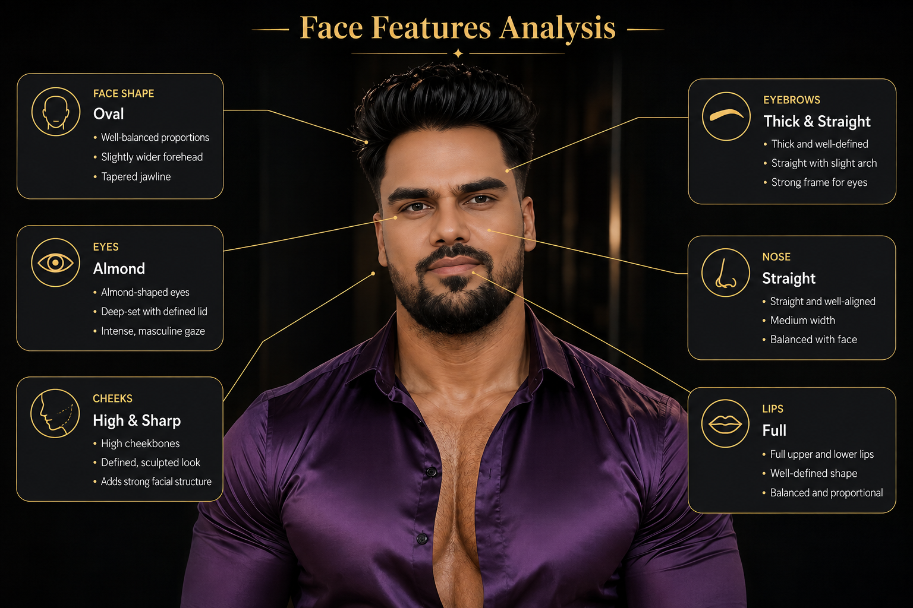
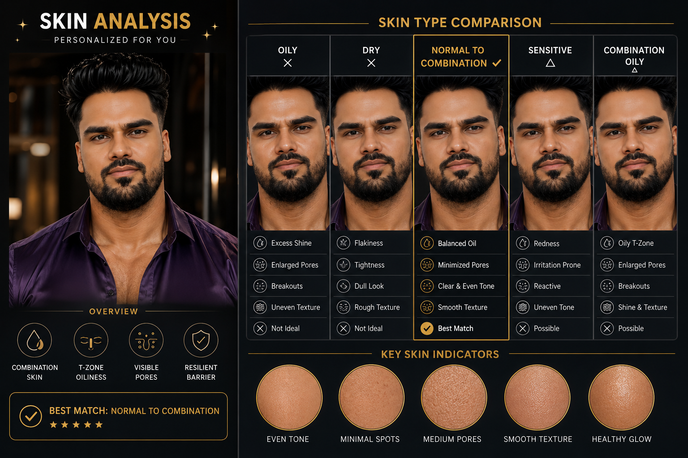
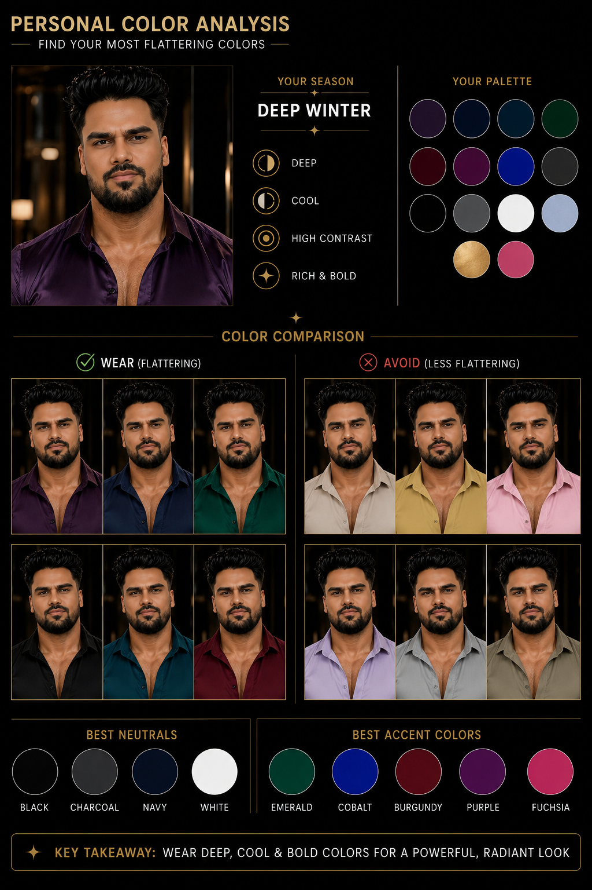
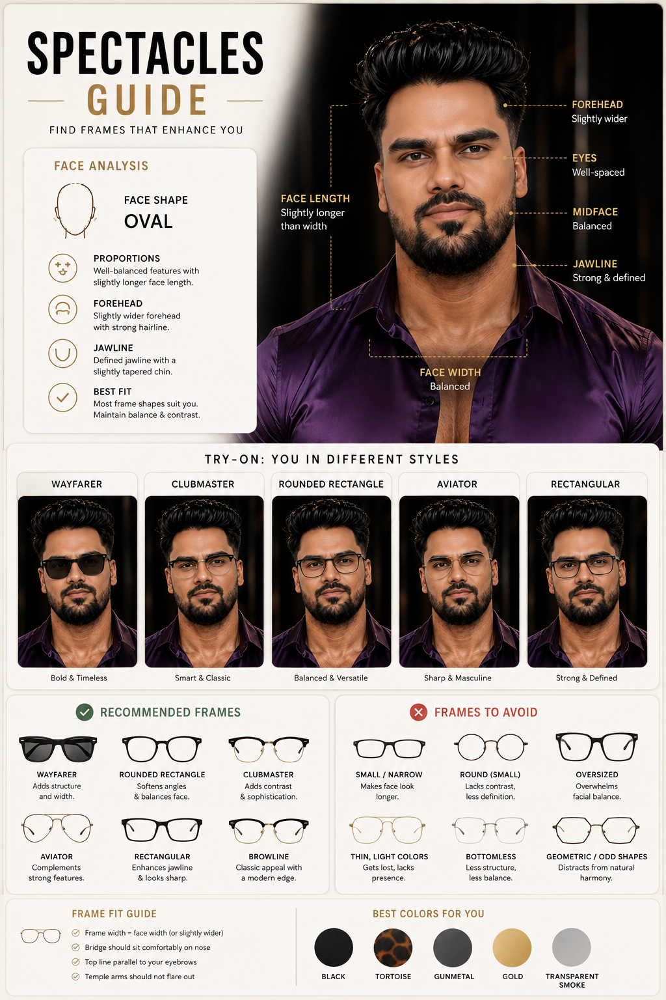
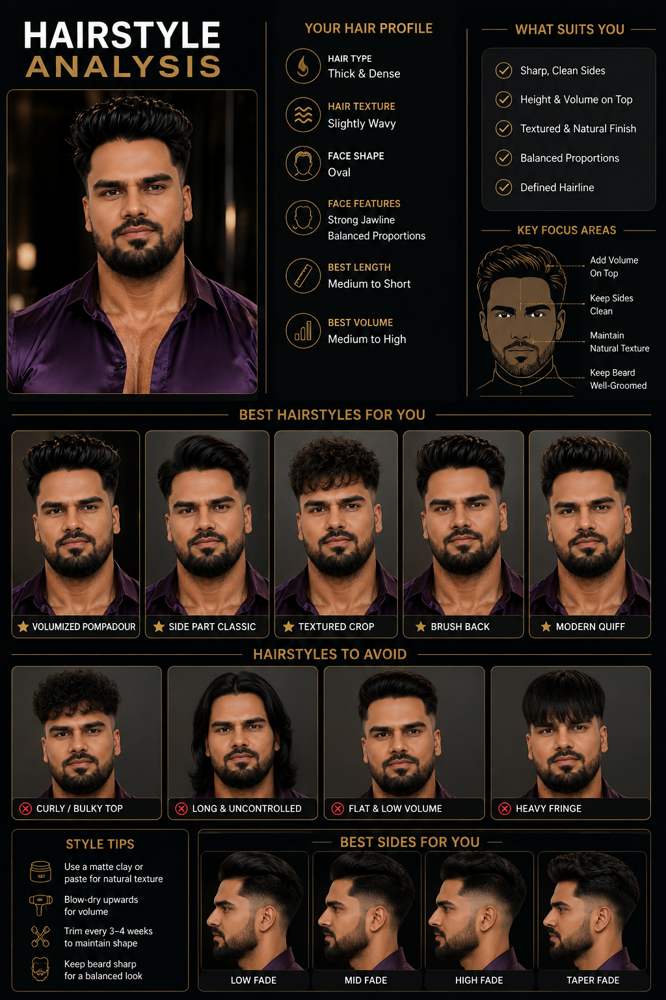

# AI-Powered Personal Style Analytics

## Overview

This project explores how computer vision and data analytics can be used to generate personalized appearance recommendations.

The system analyzes visual characteristics such as facial proportions, skin characteristics, hair characteristics, color profiles, and eyewear compatibility.

The analysis is converted into interpretable recommendation scores and visual reports.

## Project Objectives

- Analyze facial features and proportions
- Classify visual characteristics
- Recommend suitable eyewear
- Recommend suitable hairstyles
- Analyze personal color palettes
- Explore visible skin characteristics
- Generate personalized visual reports

## Project Pipeline

Image
↓
Feature Extraction
↓
Data Processing
↓
Feature Analysis
↓
Recommendation Scoring
↓
Visualization
↓
Personalized Report

## Technologies

- Python
- Pandas
- NumPy
- Matplotlib
- Computer Vision
- Scikit-learn
- Jupyter Notebook
- GitHub

## Analysis Areas

### Face Features

- Face shape
- Eyes
- Eyebrows
- Nose
- Cheeks
- Lips

### Eyewear

- Frame compatibility
- Frame shape
- Frame proportions
- Recommended styles

### Hairstyle

- Hair characteristics
- Face compatibility
- Recommended hairstyles
- Fade recommendations

### Color Analysis

- Color season
- Best colors
- Neutral colors
- Accent colors

### Skin Analysis

- Visible skin characteristics
- Texture observations
- Visual skin-type estimation

## Business Applications

Potential applications include:

- Eyewear e-commerce
- Fashion recommendation systems
- Beauty platforms
- Salon applications
- Personalized shopping
- Customer segmentation
- Product recommendation systems

## Disclaimer

This project is a portfolio/research demonstration. Appearance and skin classifications are visual estimates and should not be treated as medical diagnoses.

## Author

Arvin Patel 

## Visual Outputs

### Face Features Analysis

### Skin Analysis

### Color Analysis

### Spectacles Guide

### Hairstyle Analysis

## Exploratory Data Analysis

The project investigates relationships between:

- Face shape and eyewear suitability
- Face proportions and hairstyle suitability
- Color characteristics and clothing colors
- Hair characteristics and hairstyle recommendations
- Visual skin characteristics and skincare categories

## Project Status
- Ongoing 
